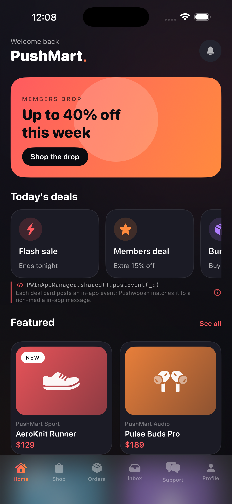
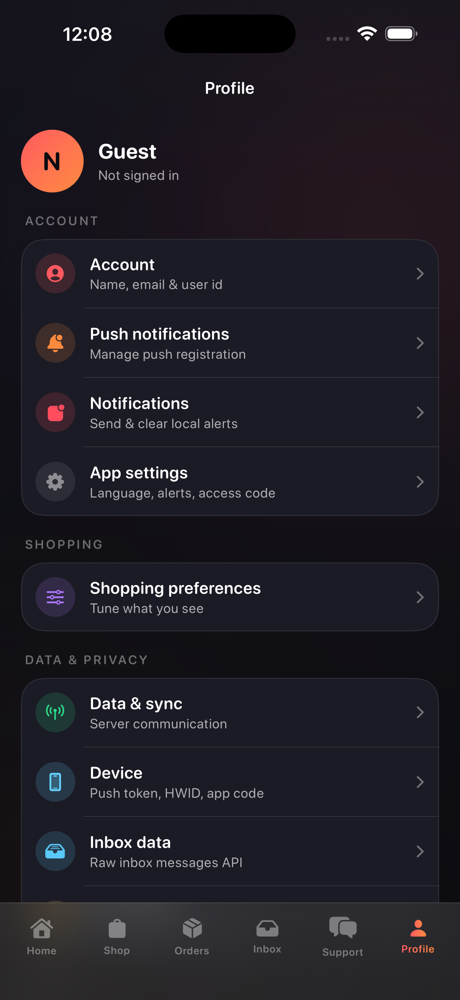
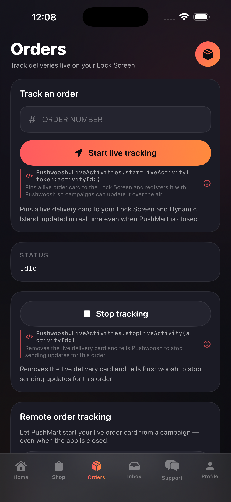
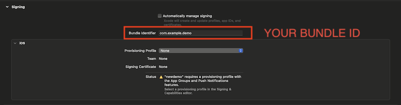
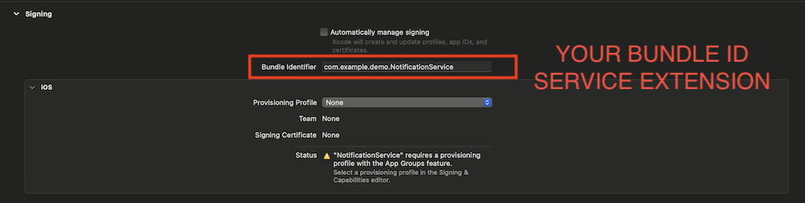
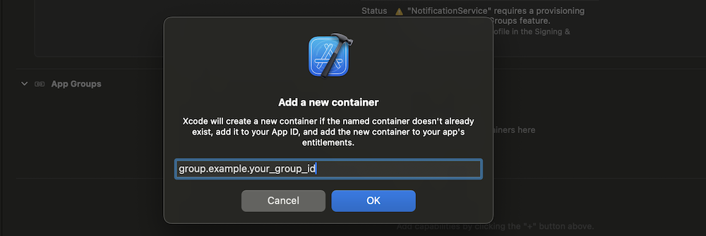

# PushMart - Pushwoosh iOS SDK Sample 🛍️

[](https://swift.org/package-manager/)

<p align="center">
  
  
  
</p>

**PushMart** is a demo storefront that exercises the Pushwoosh iOS SDK end to end: push notifications, in-app messages, inbox, Live Activities, VoIP calling and audience segmentation, all inside a realistic shopping experience. Use it to see any SDK feature working on a device and to copy the integration into your own app.

> Every screen and user action is mapped to the exact SDK method it calls in **[Docs/SDK_CALLS.md](Docs/SDK_CALLS.md)**. Start there to find the integration point for a given feature.

## What it demonstrates

- **Push notifications:** registration, provisional (quiet) authorization, foreground in-app banner, delivery status, and custom-data deep links.
- **Identity and channels:** user IDs, email addresses, SMS and WhatsApp registration, and user merge.
- **Segmentation:** string / list / increment tags, per-email tags, and loading tags back.
- **Events and purchases:** `postEvent`, in-app purchase tracking, and app-icon badges.
- **Inbox:** the drop-in `PushwooshInboxKit` UI (default and customized cells) plus the raw `PWInbox` data API.
- **Rich media:** modal presentation styles, animations, and a native JavaScript bridge.
- **Live Activities:** start / stop, remote push-to-start, scheduled activities, and the SDK's bundled default activity.
- **VoIP calling (PushMart Care):** CallKit voice / video calls, callbacks, and incoming-call handling.
- **Configuration:** reverse-proxy routing, language, server-communication control, and log level.

## Requirements

- Xcode 26 or later (the Live Activities demo uses iOS 26 scheduling APIs).
- iOS 17.0 or later. Push, VoIP and Live Activities require a real device.
- A [Pushwoosh account](https://www.pushwoosh.com) with an Application. You will need its **Application Code** and a **Device API token** (Pushwoosh Control Panel: API Access).

## Setup

The SDK is integrated via Swift Package Manager (`PushwooshFramework` plus the optional `PushwooshInboxKit`, `PushwooshLiveActivities` and `PushwooshVoIP` modules from [Pushwoosh-XCFramework](https://github.com/Pushwoosh/Pushwoosh-XCFramework)). Xcode fetches it automatically when you open the project; change the version on the Package Dependencies tab.

The project ships with placeholder identifiers (`com.example.*`) and signing turned off, so make it yours:

### 1. Signing and Bundle Identifiers

Select each target, set your Team, then replace the placeholder Bundle Identifier with your own on all five targets. Keep the extension identifiers nested under the main app identifier:

- `PushwooshSampleApp` (main app), for example `com.yourcompany.pushmart`
- `NotificationService` (Notification Service Extension)
- `ContentExtension` (Notification Content Extension)
- `LiveActivityDemo` (Widget Extension)
- `PushwooshSampleAppClip` (App Clip)




### 2. App Groups

Create an App Group tied to your bundle identifier and enable it on the main app and the Notification Service Extension. The SDK shares push delivery data through it.



Then set the same group name in the main app's `Info.plist`:

```xml
<key>PW_APP_GROUPS_NAME</key>
<string>group.com.yourcompany.pushmart</string>
```

### 3. Device API token

Add your Pushwoosh Device API token to the main app's `Info.plist`:

```xml
<key>Pushwoosh_API_TOKEN</key>
<string>YOUR_API_TOKEN</string>
```

### 4. Run and connect

Build and run on a device, then enter your Pushwoosh **Application Code** on the onboarding *Connect* screen and sign in with an email. The app registers for push notifications and every screen becomes live.

## Documentation

- Per-screen SDK-call reference: **[Docs/SDK_CALLS.md](Docs/SDK_CALLS.md)**
- SDK integration guide: [Pushwoosh iOS SDK docs](https://docs.pushwoosh.com/platform-docs/pushwoosh-sdk/ios-push-notifications/setting-up-pushwoosh-ios-sdk/swift-package-manager-setup)
- SDK repository: [github.com/Pushwoosh/pushwoosh-ios-sdk](https://github.com/Pushwoosh/pushwoosh-ios-sdk)

Pushwoosh team, [pushwoosh.com](https://www.pushwoosh.com)
